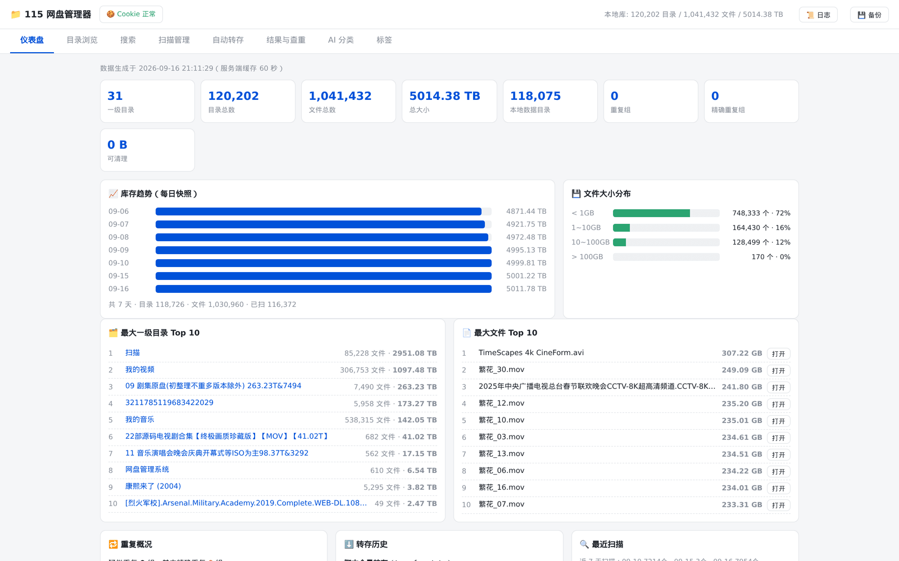
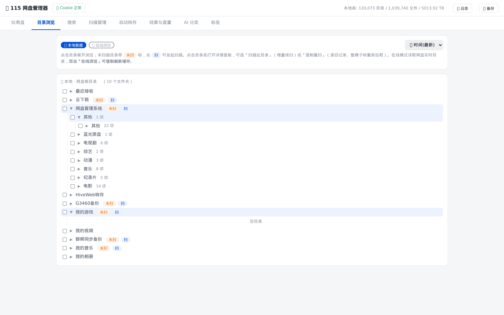
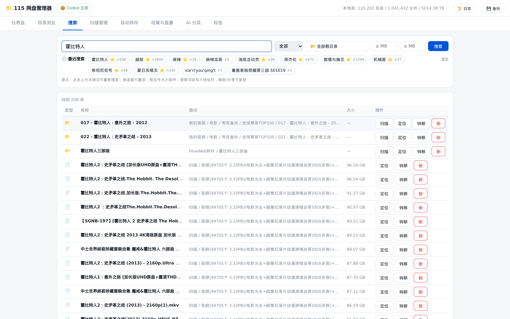
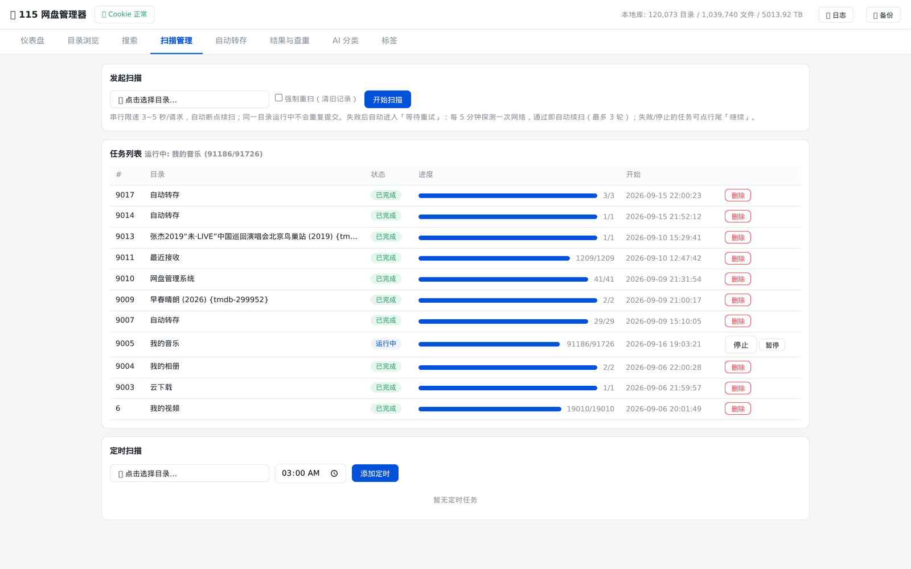
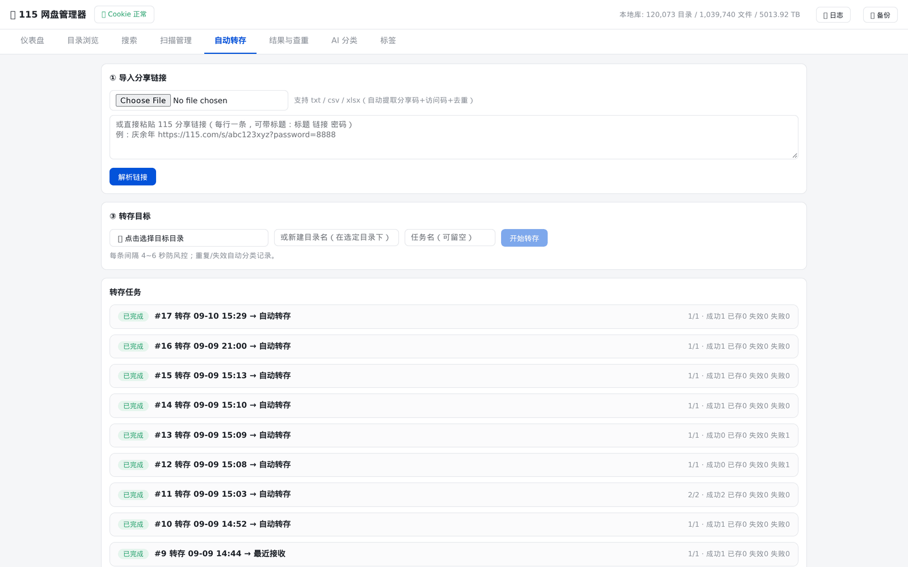
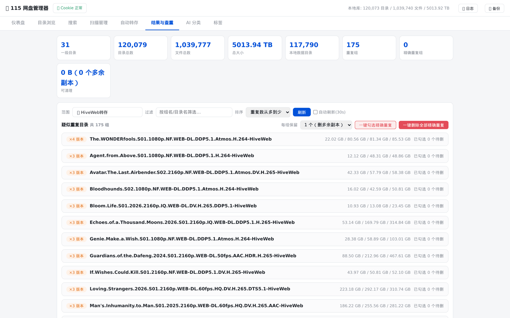
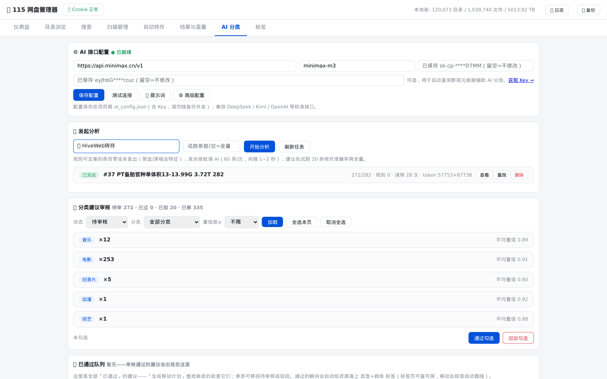
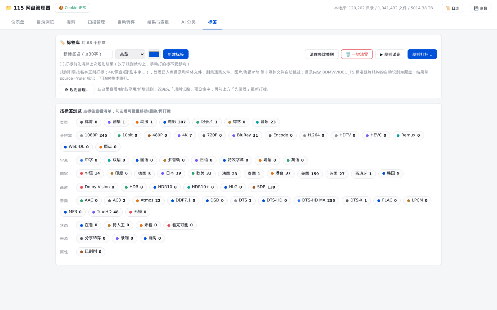
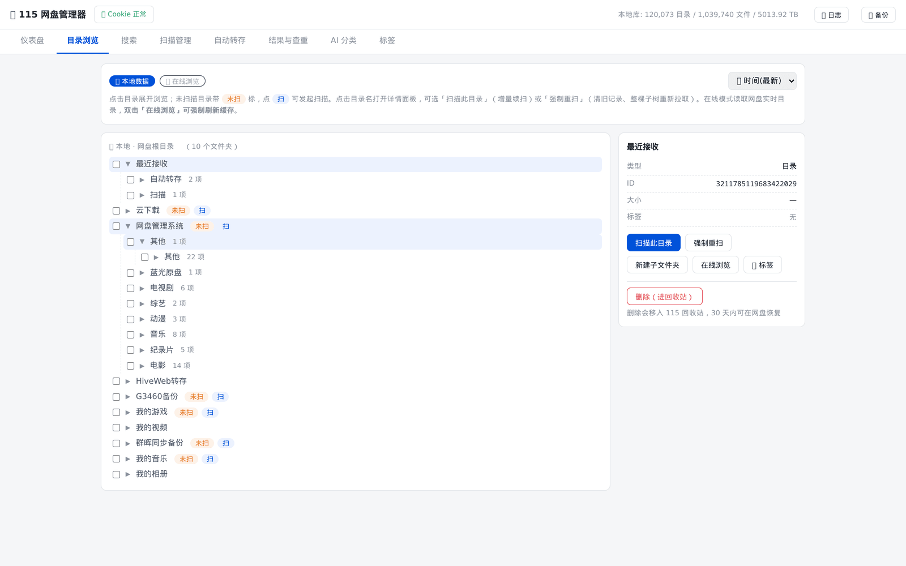
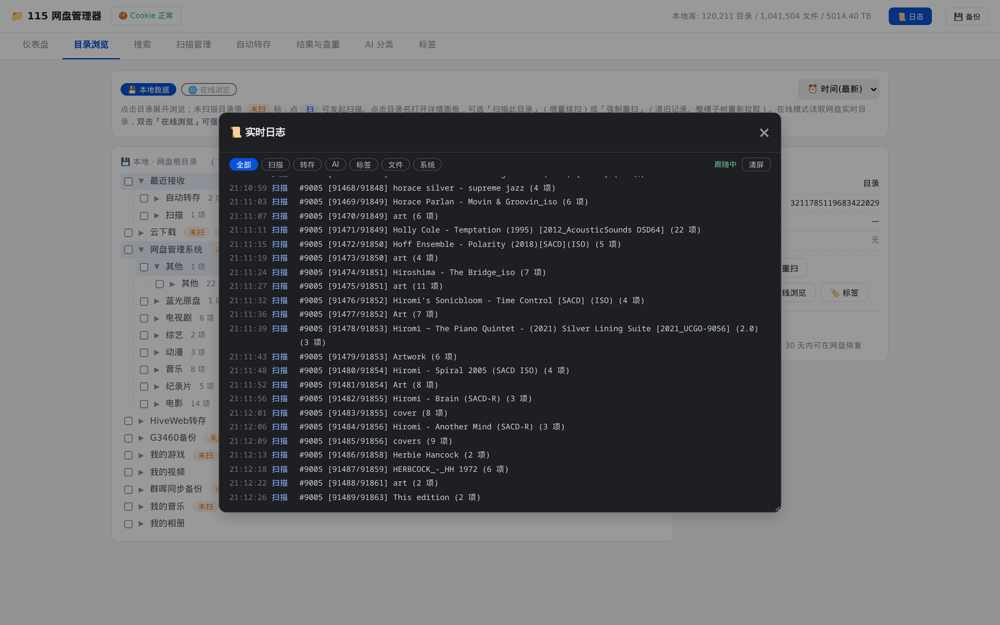

# 115 网盘管理器

> 把网盘里几十万个文件，从"云端一团乱麻"变成"本地一座随时能查的图书馆"。

你大概也经历过这些：

- 存了几年的资源，想找一部片子，得一层层点开目录，点到最后忘了自己在找什么；
- 空间快满了，想清理重复的，可同一部剧有好几个版本，靠眼睛一个个比对；
- 想认真整理分类，面对几千个文件夹，看一眼就放弃了。

这个工具的思路是：**先把你网盘的目录结构完整搬到本地**。
之后搜索、查重、分类、整理全部在本地数据库上跑，快到不像在操作网盘；
真正需要动云端的时候（转存、移动、删除），它再替你调 115 的接口，并且会自动放慢节奏、
遇到风控自动退避——**你不需要盯着它，也不会因为手快被封**。

你的目录结构、登录凭据、备份文件全部存在本机，只有需要操作网盘时才联网。

<p align="center">
  
</p>

---

## 目录

- [它能帮你做什么](#它能帮你做什么)
- [界面速览](#界面速览)
- [五分钟上手](#五分钟上手)
- [首次配置登录凭据](#首次配置登录凭据)
- [日常使用](#日常使用)
- [遇到问题](#遇到问题)
- [进阶配置](#进阶配置)
- [给开发者](#给开发者)
- [许可与更新](#许可与更新)

---

## 它能帮你做什么

| 你的困扰 | 它怎么解决 |
|---|---|
| 不知道网盘里到底有什么、有多大 | 扫描一次建成本地索引，之后总览页一眼看到目录数、文件数、总体积、增长趋势 |
| 找一个文件要翻十几层目录 | 全库搜索，输入两个字就出结果，还能按类型、根目录、大小范围叠加筛选 |
| 空间被重复文件吃掉 | 按目录名智能聚类（自动忽略 `2160p`/`WEB-DL`/`HEVC` 这类发布后缀），同名的多个版本并排列出，一眼看出该留哪个 |
| 收藏了一堆分享链接懒得一个个存 | 粘贴或上传链接清单，批量转存，自动跳过已存在的，失效的单独记下来 |
| 想整理但不知道从哪下手 | 58 个预设标签开箱即用，规则引擎按文件名自动打标，AI 还能读懂内容给分类建议 |
| 怕手滑删错东西 | 删除一律进 115 回收站（30 天内可恢复），批量操作前有二次确认；数据库每天自动备份 |

---

## 界面速览

### 一屏看清家底

目录数、文件数、总体积、重复情况、容量分布、体积最大的资源、最近扫描进度——
打开就是全局视角，不用再靠猜。


### 像逛本地文件夹一样浏览网盘

左侧是完整的目录树，展开层级、显示子项数量，支持按时间或名称排序。
点目录名右侧会弹出详情面板，可以扫描、新建子目录、打标签、取下载直链或删除。



### 两个字的搜索，毫秒级出结果

扫描过的内容全部在本地，搜索不再依赖网络。
结果直接给出完整路径、大小，并附带「扫描 / 定位 / 转移 / 删」快捷操作。



### 把云端目录搬进本地

选定任意层级的目录发起扫描。中途断了不要紧——已经扫过的目录会自动跳过，接着扫就行；
失败会自动等待并探测网络，恢复后自己续上。也可以设定时任务，让它在空闲时段慢慢跑。



### 分享链接，一键入库

粘贴链接或上传 `txt` / `csv` / `xlsx` 清单，解析后核对一遍再开始。
每条之间有间隔，避免触发风控；已转存过的会自动跳过并归类。



### 找出白占地方的重复副本

选好范围后，同名的多个版本会成组列出，每组能看到各自体积，方便判断保留哪一个。
支持「一键勾选精确重复」，也可以逐个手动确认。



### 让 AI 帮你先出方案，你只负责点头

接入任意 OpenAI 兼容接口（DeepSeek / Kimi / MiniMax 均可），
它会结合目录名、层级结构和内部文件给出分类与命名建议，还可以叠加 TMDB 信息补充国家、年份。
建议先小批量试跑核对准确率，确认没问题再全量分析；审核通过的建议可一键落成标签或生成移动计划。



### 一套标签，把资源管得明明白白

58 个预设标签分 9 类，覆盖类型、分辨率、字幕、国家、画质、音频、状态、来源、属性。
可以手动打标，也可以让规则引擎按文件名自动打——先用「规则试跑」看命中效果，满意再正式执行。



### 目录详情与批量操作

点开任意目录查看 ID、大小、标签，并直接发起扫描、新建子目录、在线浏览或删除。
勾选多个项目后，底部工具栏可以批量移动、打标签、删除。



### 后台在干什么，一目了然

扫描、转存、AI 分析、文件操作都会实时推送到日志窗口，
可以按来源过滤、自动跟随滚动，窗口还能拖动和拉伸。



---

## 五分钟上手

### 环境要求

- **Python 3.10 或更高版本**（依赖 FastAPI / uvicorn / curl_cffi，均要求 3.10+）
- Windows / macOS / Linux 都可以
- 首次扫描需要能访问 115 网盘

### Windows：双击就行

1. 安装 [Python](https://www.python.org/downloads/)，安装时**务必勾选 "Add Python to PATH"**
2. 双击项目里的 `启动115管理器.bat`

脚本会自动做完这些事：检查 8765 端口是否已被占用 → 找到 Python → 缺依赖就自动安装 →
启动服务并打开浏览器。

### macOS / Linux

```bash
# 首次：一键安装（检查 Python 版本、装依赖、生成配置文件）
chmod +x install.sh && ./install.sh

# 日常启动
chmod +x start.sh && ./start.sh
```

### 手动启动

```bash
# 建议先建一个虚拟环境，避免和系统里的 Python 包冲突
python3 -m venv venv
source venv/bin/activate        # Windows 用 venv\Scripts\activate

pip install -r requirements.txt
python server.py
```

也可以用 `python3 run.py`，它会自动检查环境、按需安装依赖再启动。

> 依赖装得慢或失败，可以换国内镜像：
> ```bash
> pip install -r requirements.txt -i https://pypi.tuna.tsinghua.edu.cn/simple
> ```

### 打开界面

- 本机：<http://127.0.0.1:8765>
- 同一 Wi-Fi 下的手机 / 平板：`http://本机IP:8765`（启动时会打印本机 IP）

想改成只能本机访问，把 `.env` 里的 `HOST` 设为 `127.0.0.1` 即可。

---

## 首次配置登录凭据

程序需要一个已登录 115 的 Cookie 才能读取你的网盘。获取方式：

1. 用 Chrome / Edge 打开 <https://115.com> 并登录
2. 按 `F12` 打开开发者工具，切到 **Network** 标签
3. 点一下页面触发请求，找到任意一个请求
4. 在 **Request Headers** 里找到 **Cookie**，复制整行值
   （要包含 `UID` 和 `USERSESSIONID` 两个字段）
5. 在项目目录下新建 `cookie115.txt`，把这一行粘进去

配好之后，页面右上角会显示「● Cookie 正常」。

也可以直接在网页上操作：点右上角的 Cookie 状态区即可更新和验证，不用手动改文件。

---

## 日常使用

### 扫描

1. 点「📂 点击选择目录…」，选一个要纳入本地索引的目录（任意层级都行）
2. 需要把这棵子树重新拉一遍，就勾上「强制重扫」
3. 点「开始扫描」，下方任务列表能看到进度

扫描是**串行**的，每个目录之间间隔 3–5 秒——这是刻意放慢，为的是别触发 115 的风控。
一个几千目录的根目录，跑上几小时是正常的。中途不用守着：断了可以续，也可以暂停。

同一页签下方还能添加**定时扫描**，指定目录 + 时间，让它在你不用网盘的时候自己跑。

### 搜索

- 输入至少 2 个字，回车即可
- 可叠加筛选：类型（全部 / 仅目录 / 仅文件）、根目录、大小范围
- 结果支持直接打开、扫描、定位、删除、下载

### 转存

1. 粘贴分享链接（每行一条，可带标题和访问码），或上传 `txt` / `csv` / `xlsx`
2. 解析后核对清单
3. 选择目标目录 → 开始转存

### 查重

1. 选择查重范围（默认全部一级目录，也可以下钻到任意层级）
2. 查看分组：精确重复 / 模糊重复 / 重复版本数
3. 勾选要删除的副本 → 批量删除（进回收站，30 天内可恢复）

> 判定「精确重复」的依据是**文件数与总大小完全一致**，不做内容哈希校验。
> 也就是说，它不会去读每个文件的内容。这个口径足够日常使用，但毕竟是近似判断，
> 删之前扫一眼体积对比更稳妥。

### AI 分类

1. 在「AI 配置」卡里填接口信息，点「测试连接」验证
2. 选择分析范围
3. 先试跑若干条核对准确率，再全量分析
4. 审核通过的建议 → 落成标签 / 生成移动计划

### 备份与恢复

- 右上角「💾 备份」→「创建备份」可手动备份
- 每天凌晨会自动备份一次，保留最近 7 份每日 + 4 份每周
- 恢复时会先自动备份当前数据库，再覆盖

---

## 遇到问题

**双击 bat 闪退 / 提示找不到 Python？**
确认 Python 已安装并加入 PATH。打开 cmd 输入 `python --version` 验证。

**依赖安装失败？**
换国内镜像重试：
```bash
pip install -r requirements.txt -i https://pypi.tuna.tsinghua.edu.cn/simple
```
或手动安装：
```bash
pip install fastapi uvicorn curl_cffi apscheduler openpyxl python-multipart pydantic aiofiles
```

**提示端口被占用（`Address already in use`）？**
先查是哪个进程占用，再改 `.env` 里的 `PORT`：
```bash
# Windows
netstat -ano | findstr :8765
# macOS / Linux
lsof -i :8765
```

**Cookie 显示「失效」或格式无效？**
Cookie 必须同时包含 `UID` 和 `USERSESSIONID`。按上面的步骤重新获取，注意只粘一行、别断行。

**提示 `database is locked`？**
说明同一个数据库被多个进程打开了。关掉其他正在运行的实例再重启。
极端情况下可以删除 `115_tree.db` 重新扫描（会丢失已扫描的数据，但网盘文件不受影响）。

**AI 提示「配置未填写完整」？**
`ai_config.json` 里的密钥字段名必须是 `key`，不是 `api_key`。
建议直接在网页端「AI 配置」卡里填，顺便点一下「测试连接」。

**AI 分类结果不准？**
先用小批量试跑核对；可以调整系统提示词和分类词表；也可以换更强的模型；个别结果手动改即可。

**扫描很慢？**
这是有意的。串行 + 每目录 3–5 秒是为了不被风控。确实想提速，可以调小 `.env` 里的
`SCAN_INTERVAL_MIN` / `SCAN_INTERVAL_MAX`，但要自己承担被限速的风险。

**被 115 风控了怎么办？**
程序会自动冷却重试（触发后冷却 600 秒）。如果持续失败，停一会儿再试。

**删掉的文件还能找回来吗？**
可以。删除是移入 115 回收站，30 天内能在网盘里手动恢复。

**想换台电脑用？**
把整个项目文件夹拷过去（含数据库、配置、凭据），装好 Python 后启动即可。

---

## 进阶配置

### 环境变量（`.env`）

复制 `.env.example` 为 `.env`，放在项目目录下（也兼容放在上一级目录），按需修改：

```env
# 服务
PORT=8765
HOST=0.0.0.0            # 改成 127.0.0.1 则仅本机可访问

# 数据库
# TREE_DB=115_tree.db

# 凭据文件
# COOKIE_FILE=cookie115.txt
# AI_CONFIG=ai_config.json

# 备份
# BACKUP_DIR=backups
# BACKUP_KEEP_DAILY=7
# BACKUP_KEEP_WEEKLY=4

# 扫描节奏
# SCAN_INTERVAL_MIN=3.0
# SCAN_INTERVAL_MAX=5.0
# SCAN_RETRY_WAIT=300
# SCAN_RETRY_MAX=3

# AI 调用
# AI_BATCH_SIZE=10
# AI_CALL_DELAY_MIN=1.0
# AI_CALL_DELAY_MAX=2.0
```

完整变量：

| 变量 | 默认值 | 说明 |
|---|---|---|
| `PORT` | `8765` | 服务端口 |
| `HOST` | `0.0.0.0` | 监听地址（`0.0.0.0` 允许局域网访问，`127.0.0.1` 仅本机） |
| `TREE_DB` | `115_tree.db` | 主数据库路径 |
| `COOKIE_FILE` | `cookie115.txt` | 凭据文件路径 |
| `AI_CONFIG` | `ai_config.json` | AI 配置文件路径 |
| `BACKUP_DIR` | `backups` | 备份目录 |
| `BACKUP_KEEP_DAILY` | `7` | 每日备份保留份数 |
| `BACKUP_KEEP_WEEKLY` | `4` | 每周备份保留份数 |
| `SCAN_INTERVAL_MIN` | `3.0` | 扫描最小间隔（秒） |
| `SCAN_INTERVAL_MAX` | `5.0` | 扫描最大间隔（秒） |
| `SCAN_RETRY_WAIT` | `300` | 扫描失败后的重试等待（秒） |
| `SCAN_RETRY_MAX` | `3` | 扫描最大自动重试轮数 |
| `AI_BATCH_SIZE` | `10` | AI 每批处理条数 |
| `AI_CALL_DELAY_MIN` | `1.0` | AI 调用最小间隔（秒） |
| `AI_CALL_DELAY_MAX` | `2.0` | AI 调用最大间隔（秒） |

> 路径类变量的相对路径基于**启动服务时的工作目录**解析，所以请在项目目录内启动。
> 优先级：环境变量 > `.env` 文件 > 代码默认值。

### AI 接口（`ai_config.json`）

复制 `ai_config.example.json` 为 `ai_config.json`：

```json
{
  "base_url": "https://api.deepseek.com",
  "model": "deepseek-chat",
  "key": "your_api_key_here",
  "batch_size": 10,
  "tmdb_api_key": ""
}
```

| 字段 | 说明 |
|---|---|
| `base_url` | 任意 OpenAI 兼容端点（DeepSeek / Kimi / MiniMax / OpenAI…） |
| `model` | 模型名，如 `deepseek-chat` |
| `key` | API Key（**字段名就是 `key`**） |
| `batch_size` | 每批处理条数，默认 10 |
| `tmdb_api_key` | 可选，用于补充国家 / 类型 / 年份上下文 |

同样可以直接在网页端「AI 分类」页签里填写，点「测试连接」验证。
系统提示词与分类词表也支持在网页端调整。

### 敏感文件

以下文件属于你的私人数据，**不要外泄、不要提交到公开仓库**：

- **`cookie115.txt`** —— 你的 115 登录凭据，拿到就能操作你的账号
- **`ai_config.json`** —— 含 AI 接口的 API Key
- **`115_tree.db`** —— 你的完整网盘目录结构，属于隐私数据
- **`backups/`** —— 内含数据库副本和凭据副本

仓库自带的 `.gitignore` 已覆盖以上文件，部署时确认它没被删掉。

---

## 给开发者

### 跑测试

```bash
./venv/bin/python tests/run.py
```

覆盖建表/迁移、链接与 Excel 解析、查重统计、AI 解析策略、停止语义、转存对账、
备份恢复七类回归场景。**全部离线**（115 接口已打桩）、**全用临时库**（不碰真实
`115_tree.db`），改完代码跑一遍就知道有没有把老功能改坏。

### 架构

```
前端层   index.html + app.js + style.css（原生，无框架、无构建）
   ↓ REST / 静态文件
API 层   FastAPI（server.py）：路由 + 静态托管 + 定时调度
   ↓
业务层   scanner / transfer_worker / ai_worker / tags / tag_rules / dedup
   ↓
基础层   api115（115 接口客户端） / db（数据库层） / config（配置） / logbus（日志总线）
   ↓
数据层   115_tree.db / cookie115.txt / ai_config.json
```

### 文件结构

```
115manager/
├── server.py              # FastAPI 主服务，提供全部 REST API
├── db.py                  # 数据库层：连接工厂 + 建表迁移 + 事务助手
├── api115.py              # 115 接口客户端（curl_cffi 模拟 Chrome 指纹）
├── config.py              # 统一配置（环境变量 / .env）
├── scanner.py             # 目录扫描管理器（后台线程 + 断点续扫）
├── transfer_worker.py     # 转存工作线程
├── ai_worker.py           # AI 分类工作线程
├── tags.py                # 标签系统（58 个预设标签）
├── tag_rules.py           # 标签规则引擎（18 条种子规则）
├── dedup.py               # 查重引擎
├── logbus.py              # 日志总线（环形缓冲 + 增量拉取）
├── tmdb.py                # TMDB 接口（可选，补充影视信息）
├── docs/images/           # README 截图
├── static/
│   ├── index.html         # 前端页面
│   ├── app.js             # 前端逻辑
│   └── style.css          # 样式表
├── requirements.txt       # Python 依赖
├── .env.example           # 环境变量示例
├── ai_config.example.json # AI 配置示例
├── install.sh             # Linux/macOS 安装脚本
├── start.sh               # Linux/macOS 启动脚本
├── run.py                 # Python 启动脚本（检查环境 + 装依赖）
└── 启动115管理器.bat       # Windows 启动脚本
```

运行时会在项目目录下生成（已被 `.gitignore` 排除）：
`115_tree.db`、`cookie115.txt`、`ai_config.json`、`backups/`。

### 数据流

- **扫描**：选目录 → `server.py` 提交任务 → `scanner.py` 逐目录调 `api115.py` → 解析后写入 `tree_nodes` / `scan_state` → `logbus` 记日志
- **转存**：粘贴链接 → `server.py` 解析 → `transfer_worker.py` 调转存接口 → 同步写入 `tree_nodes` → `logbus` 记日志
- **AI 分类**：选范围 → `server.py` 提交批次 → `ai_worker.py` 分批调外部接口（可叠加 TMDB）→ 结果写入 `ai_suggestions` → 审核通过后落成标签 → `logbus` 记日志

### 数据库表（17 张）

`tree_nodes`（目录树）、`scan_state`（断点续扫状态）、`scan_jobs`（扫描任务）、
`schedules`（定时扫描）、`tags` / `node_tags` / `tag_rules` / `app_settings`（标签体系）、
`transfer_tasks` / `transfer_items`（转存任务）、
`ai_batches` / `ai_suggestions` / `ai_move_history`（AI 分类）、
`search_history`（搜索历史）、`stats_history`（统计快照）、`cookie_meta`（凭据元信息）。

建表与迁移统一由 `db.py` 负责，进程内只在首次取连接时执行一次。

### API 端点

共 69 个路由，按模块分组：

| 分组 | 数量 | 主要端点 |
|---|---|---|
| 系统 | 3 | `/api/health`、`/api/dashboard`、`/api/logs` |
| 目录 | 6 | `/api/roots`、`/api/tree/{cid}`、`/api/node/{cid}`、`/api/live/{cid}`、`/api/nodes/tags` |
| 搜索 | 4 | `/api/search`、`/api/search/history` |
| 扫描 | 6 | `/api/scan/start`、`/api/scan/jobs`、`/api/scan/pause\|resume\|stop/{jid}` |
| 定时 | 3 | `/api/schedules` |
| 转存 | 6 | `/api/transfer/parse/text`、`/api/transfer/parse/file`、`/api/transfer/task`、`/api/transfer/tasks` |
| 文件操作 | 5 | `/api/fs/mkdir`、`/api/fs/move`、`/api/fs/delete`、`/api/fs/delete/batch`、`/api/fs/download/{cid}` |
| AI | 14 | `/api/ai/config`、`/api/ai/config/test`、`/api/ai/analyze`、`/api/ai/batches`、`/api/ai/suggestions`、`/api/ai/plan`、`/api/ai/move-history` |
| 标签 | 14 | `/api/tags`、`/api/tags/apply`、`/api/tags/rules`、`/api/tags/rules/run`、`/api/tags/cleanup` |
| 查重 | 1 | `/api/dups` |
| 备份 | 3 | `/api/backup`、`/api/backups`、`/api/backups/restore/{name}` |
| 凭据 | 3 | `/api/cookie`、`/api/cookie/test` |

> `/api/cookie` 只返回长度与格式标志（是否含 `UID` / `USERSESSIONID`），不返回凭据明文。

### 防风控机制

- `api115.py` 用 curl_cffi 的 `impersonate="chrome124"` 模拟 Chrome 的 TLS 指纹
- 检测到 WAF 拦截后自动冷却 **600 秒**再重试
- 各模块自带间隔：扫描 3–5 秒/目录、转存 4–6 秒/条、AI 调用 1–2 秒/条
- 扫描任务全局串行，避免并发压垮接口

### 目录选择器

全站 8 处目录选择（查重范围、AI 分析范围、转存目标、批量移动目标、发起扫描、定时扫描、
搜索范围、AI 移动父目录）统一复用 `app.js` 中的 `pickDir()` 组件：

```js
const sel = await pickDir({title, cid, name, persistKey, allowAll, allLabel, allCid, withFilter});
// → {cid, name, mode, exists, scan_state}；取消返回 null
```

支持本地 / 在线双模式、排序、按 `persistKey` 隔离的展开状态记忆；选中未入库目录时会明确提示。

### 日志实现

`logbus.py` 使用内存环形缓冲（2000 条，`seq` 单调递增作游标），
前端通过 `GET /api/logs?after=<seq>` 每 2 秒增量拉取。**不是 WebSocket。**

### 扩展开发

1. **加接口**：在 `server.py` 新增路由
2. **改前端**：直接编辑 `static/` 下的 HTML/JS/CSS，无需构建
3. **换 AI 提供商**：改 `base_url` 即可（任意 OpenAI 兼容端点）；特殊协议改 `ai_worker.py`
4. **自定义标签规则**：改 `tag_rules.py` 的正则，或用网页端「规则试跑」调试

---

## 许可与更新

本项目仅供个人学习使用，请勿用于商业用途。

### 更新日志

**v1.4.0**（2026-09-23）
- 全面体检代码质量与架构，修复 8 个深层问题（每项均经真实库 / 模拟场景实测验证）：
  - 全新安装时标签系统整体报错（建表与代码字段不一致）——现已统一，并支持老库自动升级
  - 恢复备份改为"先停稳后台任务、再安全换库文件"——杜绝数据库损坏风险与后台线程泄漏
  - 查重页的文件数/大小几乎恒为 0，还会把内容不同的目录误判成"精确重复"——统计口径已修正
  - AI 分析出的字幕信息此前存不进库（「中字」标签永远打不上）——现已入库并正常落标
  - AI 分类会被分析理由里的字串反向改判（"音乐纪录片"变成"音乐"）——现以分类字段为准，
    存疑结果只降置信度并打标记交人工复核
  - 粘贴"链接 + 访问码"两行格式的分享时，访问码被当标题吃掉导致每条必转存失败——已修复；
    Excel 上传时纯数字片名（如 `2012`）不再被误当访问码
  - "停止"按钮对排队中的任务假成功（界面说停了、任务照跑）——扫描/转存/AI 三处全部改为真停
  - 转存后的本地登记改为"快照差集对账"，只登记网盘真实编号，不再产生云端查无此项的假记录；
    新增 `ghosts.py` 大扫除工具（找嫌疑 → 联网核对 → 留底清理，绝不碰云端）
- 标签页改版：每个分类独占一行；按设计顺序排列（4K→1080P→720P…）；自定义标签自动带分类
  主题色（不再全灰）；计数字重弱化；**拖过的分组以你的顺序为准**（重启也不变），老库乱序自动修正
- 修复标签拖拽排序的监听器泄漏（编辑几次后拖一下会重复发送几十次保存请求）

**v1.3.0**（2026-09-20）
- 标签支持拖拽排序；新增多标签组合筛选（交集 / 并集）与「编辑模式」开关
- 「最近扫描」改为显示真实路径——原先只拼「扫描根 + 叶子名」，中间层级被整个吞掉，
  会让人误以为该目录就挂在扫描根下面；窄列只做显示裁剪，**悬停提示始终给出完整路径**
- 扫描管理页新增「📂 当前扫到的子目录」（首页活跃任务卡片同步显示），实时日志也改为输出完整路径
- 修复 115 接口对个别目录返回 `???` 时被原样入库（现用同一请求的 `path` 数组兜底纠正）
- 修复进程重启后正在运行的扫描任务变成孤儿（状态永久停在 running，且界面无恢复入口）
- 修复「最近扫描」行内长目录名溢出压住右侧列、时间戳被截成 `20:35:4` 的布局问题
- README 重写为面向使用者的叙述，并补充 10 张界面截图

**v1.2.0**（2026-09-16）
- 凭据接口不再回传明文，恢复备份增加文件名校验
- 修复删除目录时文件行未一并清理（长期使用会累积无效数据、影响统计口径）
- 修复批量移动部分失败时被当作全部成功（导致本地与云端不一致）
- 后台任务停止改为按任务隔离，修复停止排队任务会误杀正在运行的任务
- 被高优先级任务抢占的扫描任务现在会自动恢复
- 新增 `db.py` 统一数据库层，消除多处重复的建表逻辑
- 前端请求增加超时；修复切换筛选后批量操作可能命中已隐藏记录

**v1.1.0**（2026-09-14）
- 文档合并进 README，并按代码实际行为重写
- 修复扫描线程启动、扫描目录归属、配置文件路径等问题
- 全站目录选择器统一为 `pickDir()` 组件

**v1.0.0**（2026-09-14）
- 首个版本：目录浏览、扫描、转存、查重、AI 分类、标签管理、备份恢复
